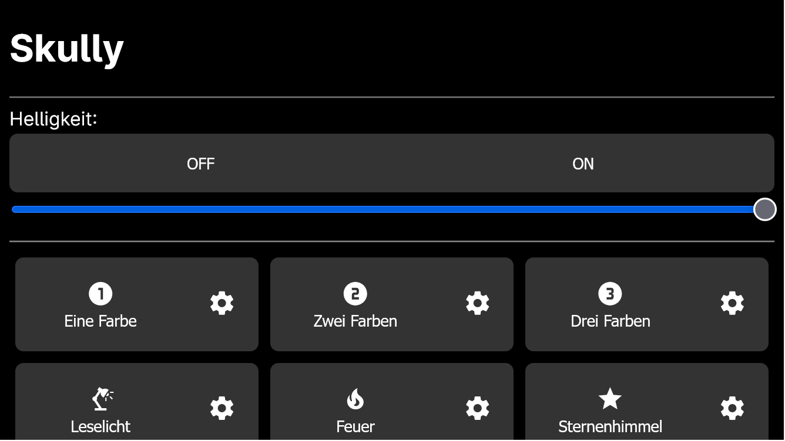
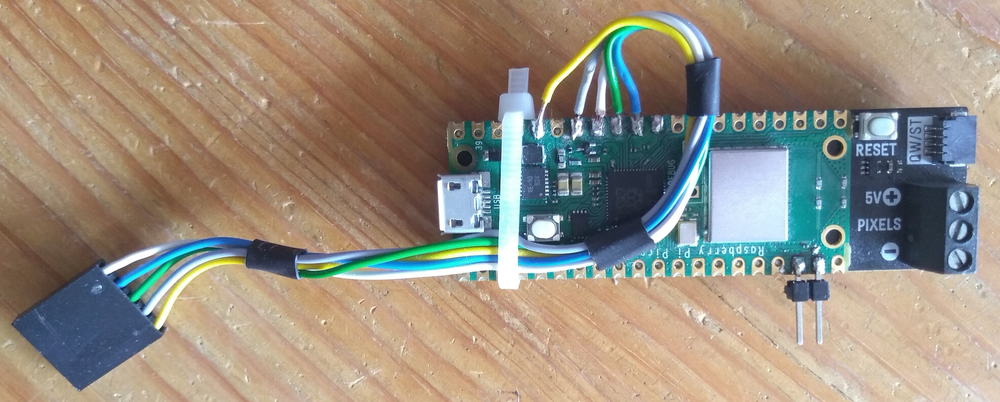

# Skully


A blinking skull! And a blinking string of lights!

I bought two of these: https://shop.pimoroni.com/products/wireless-plasma-kit?variant=40362173399123 (one Skully Edition and one Bring your own Bottle edition).


They will connect to your local network, so you can change the settings via your browser.



The string without a bottle also has some buttons connected to it for easy access.

## Setup

1. Build it: https://learn.pimoroni.com/article/assembling-wireless-plasma-kit

2. Add the buttons if you want to:
    The case I used is in the `doc/cad/` folder. I've made it in a bit of rush and it was tricky to put it together and have it work flawlessly, so you might want build something better than I did.
    Either way, you'll need three buttons, all Pullups (`GP28`: Next mode, `GP27`: Reading Light, `GP26`: Power button)
    

3. Install [Circuitpython](https://circuitpython.org/board/raspberry_pi_pico_w/). I have used version 8.0.3, any version after that *should* also work

4. Once installed, copy the code on the Pico

5. And set it up:

    1. Create a `settings.toml` file in the main directory of the Pico with the following content:
        ```toml
        CIRCUITPY_WIFI_SSID="<YOUR_WIFI_NAME>"
        CIRCUITPY_WIFI_PASSWORD="<YOUR_WIFI_PASSWORD>"
        ```

    2. Make sure the router gives both Picos always the same IP-address.

    3. In the `main.py` change the IP-addresses to the ones the Pico got by the router. This way, the Pico with the buttons can communicate to the one without the buttons to turn off as well.
        You can also set the IP-address of your smartphone (or other device). When this device wasn't in the network for more than 10 minutes, the lights will automatically turn off. If you don't want that, set `enable_smartphone_search` to `False`.

6. That's it. If you're lucky, it should work now.

To change the mode/settings, open the IP-address in your browser.

## Folder Structure

| Path            | Description                                                  |
| --------------- | ------------------------------------------------------------ |
| `circuitpython` | a copy of the source code on the Raspberry Pi Pico. I use FreeFileSync for syncing |
| `doc`           | some Documentation and CAD-Models                            |


## Code Structure

*there isn't one. it's quite a mess. sry*


## Folders

| folder  | content                                                      |
| ------- | ------------------------------------------------------------ |
| `lib`   | Contains the necessary libraries, which are `adfruit_httpserver/`, `adafruit_pixelbuf.mpy`, `adafruit_requests.mpy`, `colorsys.py` and `neopixel.mpy` |
| `modes` | Contains the modes that can be chosen, one file for each mode. See more below |
| `www`   | Contains the website template, also more down below          |

## Files

### `boot.py`

This file mounts the storage, so we can write and load the config. The code may look like it checks multiple pins, but for some reason, it only works with the last one (GP14). When this one is connected to ground, the storage will be mounted as readonly, so that we can access the code change it. Otherwise, it will be mounted with writing enabled, so it can save it's config[^ada_storage_mount].


### `code.py`

Usually the you would code there, but VS-Codes warning's annoyed me, which means that the main code is in `main.py`


### `main.py`

This is the main code. It takes care of:

- Creating objects of the modes
- Setting up the Internet connection and Server
- Handling incoming requests
- Setting up the buttons
- the main loop:
    - Reading the buttons
    - Updating the LEDs/current mode
    - Checking the server and other stuff


### `led.py`

Manages the LEDs, including setting the colour of every and controlling the brightness.
Also provides some Helper functions for converting colour encoding and linear interpolations


### `storage_management.py`

Takes care of the saved config. Loading it at start up, writing the current config during runtime


### `elements.py`

Saves the classes from which the webpage will be generated.
All classes should derive from `SuperElement` and override its methods `__init__()`, `get_html()` and `set_current()`


### `modes/`

Contains the different modes. Each mode is implemented in a class the derives from `SuperMode`.
Necessary methods for each mode:

- `__init__(self, id, title, icon)`: initialize with a specific id, title and icon
- `setup(self)`: Creates the web-elements and appends them to `self.elements`
- `input(self, id, value)`: Change the value of a certain elements. Will be called, when a web request is being handled. To update the `self.elements`, call `super().input(id,value)`. Then update internal variables
- `update(self, counter)`: updates the animation, will be called approx. every 30 ms. The `counter`-parameter allows the animation to be a function of time
- `get_dict(self)`: returns dictionary containing the internal variables with the element-id as a key. Used to save the config on disk


### `www/`

Saves the webpages. `{x}` (with `x` $\in \mathbb{N}$) will be replaced with the correct text in code

- `index.html` contains the main page. `{1}` will be replaced with a list of the modes
- `mode_block.html` describes the mode list on the main page
- `mode_config.html` contains the template for mode configuration. will be filled with the elements of the current mode
- `*.css` for styling, duh
- `source/` just includes some icons


---

## Credits

- Icons from [Pictogrammers](https://pictogrammers.com/library/mdi/)
- <a href="https://www.freepik.com/free-vector/ornamental-borders-collection_1188383.htm#query=ornament%20svg&position=26&from_view=keyword&track=ais">Image by alvaro_cabrera</a> on Freepik


[^ada_storage_mount]: refer to this [Tutorial](https://learn.adafruit.com/circuitpython-essentials/circuitpython-storage) from Adafruit for more information
